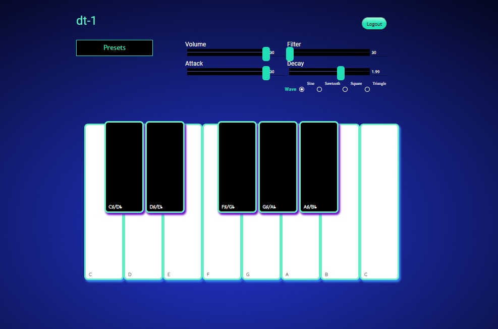

# dt-1

## Description
The dt-1 is a simple yet effective, portable synthesizer. It features 4 pitch settings and 4 different waves, giving the user the experience of a synthesizer without all the wires and configuration.

The dt-1 allows the user to save up to 3 presets which are then editable.

## User Story
Given I am a busy, aspiring musician on the go\
I want an app that allows me to explore and hone my craft\
When I open the app\
Then I am asked to Log In to my own account or Sign Up\
When I am logged in\
Then I am able to immediately experiement with the keyboard\
When I toggle the pitch sliders\
Then I am able to manipulate the sound of the keyboard\
When I create tone I like\
Then I am able to save it as a preset\
When I want to tweak a preset or save over a new one\
Then I am able to do so\

## Technologies
* React
* Material-ui
* Node.js
* Axios
* Mongo
* Express 
* Heroku

## Demo

## Contributors
Frontend &ndash; [Sara Taylor](https://github.com/SaraSwifti)\
Frontend &ndash; [Sarah DeMercurio](https://github.com/sdemercurio)\
Backend &ndash; [Colin Mudie](https://github.com/ColinMudie)\
Backend &ndash; [Hector Diaz](https://github.com/HectorDiazJr)\

## Links
[GitHub Repository](https://github.com/ColinMudie/Dream-Team)\
[Heroku Deployment](https://dt-01.herokuapp.com/)\

